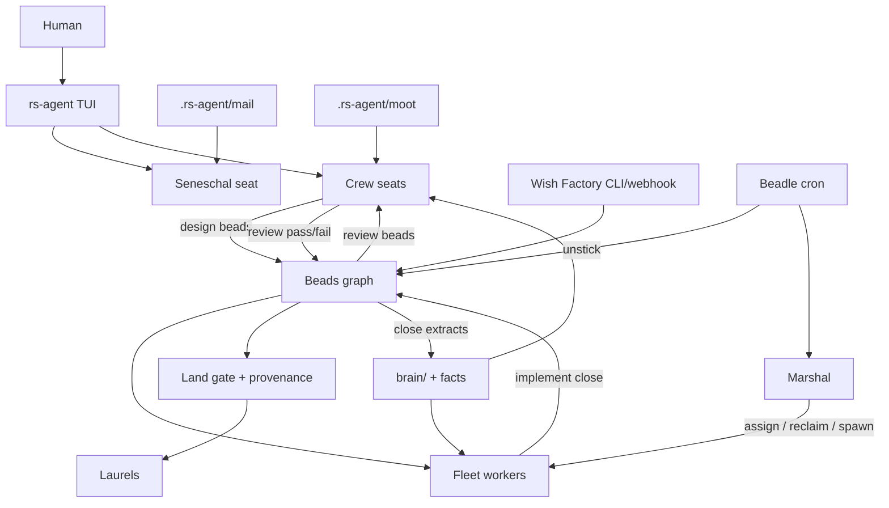

# rs-agent City Roadmap (full plan)

Source essays:

- [The Shape of Things to Come, Part 1](https://yegge.ai/essays/the-shape-of-things-to-come/)
- [Model Welfare, Part 2](https://yegge.ai/essays/model-welfare/)

**Product constraint:** rs-agent **TUI + CLI** are the product (no Emacs / Wheelhouse /
browser ops cockpit as primary). Deep Context stays the USP. UI IA:
[ui-ia.md](ui-ia.md). Desktop later = thin socket client ([desktop.md](desktop.md)).

**Honesty:** What shipped as “Phase 1–2” is a **factory scaffold**, not a city. This plan replaces that half-plan. Every phase below must leave a **working operator loop**, not a status string that looks like a feature.

---

## North star (essay, condensed)

```text
Human ambition
  → Crew (strong designers) produce beads
  → Fleet (cheaper implementers) consume beads
  → Crew review
  → Land / gates
  → Laurels / recognition
Wish Factory → beads
Standing role agents (ops) → beads / mail
Brain + closed beads → institutional memory
Marshal runs fleet; Seneschal is human front door
```

You sleep. In the morning: backlog smaller, reviews waiting or landed, mail/wishes triaged, nothing wedged without a Beadle nudge.

---

## Current scorecard (truth)

| Essay need | Today | Grade |
|---|---|---|
| Interactive loop + tools + Deep Context | Mature | Have |
| Overnight claim loop | `worker --loop` | Have (blind) |
| Beads deps / leases / lock / pipeline kinds | Real | Have |
| Brain + wake prime | Thin (cap + no falsify UX) | Thin |
| Seats / handoff / laurels / escalate | Primitives | Thin city |
| Soft-goal hygiene + crash recover | Real | Have |
| Live worker observability | Status/Error stderr only | **Fail** |
| Fleet launcher | Manual terminals | **Fail** |
| Crew ≠ Fleet ≠ Review castes | Free-text role; any seat claims any bead | **Fail** |
| Marshal that assigns | reclaim + print | **Fake** |
| Seneschal / mail | Missing | Missing |
| Wish Factory | Missing | Missing |
| Standing roles (Beadle, etc.) | Missing | Missing |
| Moot / agent meetings | Missing | Missing |
| Commit↔bead provenance | Missing | Missing |
| Knowledge from closed beads → brain | Missing | Missing |
| Thunderdome CI | Out of scope as merge product | Document only |
| Max-account token tap | Out of scope | User ops |

**Bottom line:** chariot + closed graph + blind overnight worker. Not civilization.

---

## Design principles (non-negotiable)

1. **No facade features.** If `/fleet` exists, it must start/stop/list real processes or bind to real seat claims — not reprint marshal.
2. **Observability before scale.** Never ask the user to run N blind workers again.
3. **Castes are enforced in claim routing**, not vibes in prompts.
4. **Crons watch, models act** for standing roles (launchd-friendly CLI + heartbeat files).
5. **Welfare is architecture:** wake with purpose, handoff not clonk, laurels without work attached, escalate/refuse, bounded workday, blameless postmortems into brain.
6. **One interactive surface:** rs-agent TUI. Fleet runs headless; TUI is the cockpit.
   City uses overview+inspector (never replace the board). Chat is not an ops log.
7. **Project-local city state** under `.rs-agent/` (+ `brain/`). Seats stay in `~/.rs-agent/seats/`.
8. **UI is a client of durable state** — Unix control socket is the shared API for TUI,
   CLI, and a future thin desktop host. No second data path.

---

## Architecture (target)



### City filesystem

```text
.rs-agent/
  beads.json              # work graph (+ events.jsonl later)
  beads.json.lock
  worker-status.json      # deprecated → per-seat status
  fleet/
    Fleet-1.status.json   # live progress + last tool + pid
    Fleet-1.session.json  # resumable transcript pointer
    Fleet-1.log           # rolling text log
  mail/
    inbox/*.json
    outbox/*.json
  moot/<id>.json
  ledger.jsonl            # commit↔bead provenance
  hooks/
brain/
  *.md
  facts.jsonl
```

---

## Phases (locked order — each phase is shippable)

### Phase A — See the factory (observability + empty-queue honesty)

**Why first:** You cannot run a city you cannot see. Current pain is existential.

Deliverables:

1. Worker streams **tool + text summaries** to:
   - stderr (optional `--verbose`)
   - `.rs-agent/fleet/<seat>.log`
   - `.rs-agent/fleet/<seat>.status.json` (bead id, last tool, last line, pid, heartbeat_at, state)
2. Persist worker session id → `-r` / TUI can open “what Fleet-1 did”
3. Idle messaging distinguishes:
   - no open beads
   - open but **not ready** (deps/gated/blocked) with counts
   - sleeping with next wake time
4. TUI `/fleet` live panel: seats, pid alive?, bead, last tool, age since heartbeat
5. Heartbeat **during** long turns (timer), not only after

Success:

- With worker running, second terminal `/fleet` updates every few seconds without guessing.
- Empty backlog does not look like “working.”

---

### Phase B — Real fleet orchestration

Deliverables:

1. `rs-agent fleet up --seats Fleet-1,Fleet-2 --budget-minutes 480 -a`
   - spawns workers as child processes (or launchd plist generator on macOS)
   - writes pid files under `.rs-agent/fleet/`
2. `rs-agent fleet status | down | logs <seat>`
3. TUI `/fleet up|down|logs` mirrors CLI into system chat
4. Per-seat status files (retire single global `worker-status.json` or make it an aggregate)

Success:

- One command starts a 2-worker fleet; `/fleet` shows both; `fleet down` stops both.

---

### Phase C — Castes: Crew / Fleet / Review (enforced)

Deliverables:

1. Seat `caste`: `crew | fleet | review | marshal | seneschal | role`
2. Claim routing:
   - Fleet may claim `kind=implement` only (configurable)
   - Review caste / crew claims `kind=review`
   - Crew claims `kind=design` (+ may create pipeline)
3. Worker prompt profiles per caste (not one blob)
4. Optional strong/cheap models already on seat — **required** for crew vs fleet defaults in docs
5. Marshal **assigns**: `rs-agent marshal assign --seat Fleet-1 --bead b12` or auto-assign ready implement beads to idle fleet seats

Success:

- Fleet-1 cannot claim a design bead.
- Closing design always yields implement; implement close yields review; review fail reopens implement (already have — keep, harden tests).
- Marshal can pin work to a seat.

---

### Phase D — Marshal for real

Deliverables:

1. `rs-agent marshal --loop` (cron-friendly): reclaim stale, detect dead pids, requeue, print/assign
2. Policies: max beads/seat, prefer idle seats, escalate stuck > N minutes to mail
3. TUI `/marshal` runs once + shows last marshal report
4. Seat role `marshal` actually invokes marshal loop when `rs-agent role run --seat Marshal`

Success:

- Kill a worker mid-bead → within lease window Marshal reclaims → another fleet seat picks it up without human.

---

### Phase E — Seneschal + mail (human front door)

Deliverables:

1. `.rs-agent/mail/inbox` messages: from, to_seat|broadcast, body, bead refs
2. Tools: `mail send|read|ack`
3. TUI `/mail`, `/mail send …`
4. Seneschal seat: standing orders = triage mail → beads or crew; only seat allowed to spam crew when human away (flag)
5. `escalate` writes mail to Seneschal/human instead of only pausing goal

Success:

- From phone/SSH you run one TUI bound to Seneschal and dispatch; fleet keeps working.

---

### Phase F — Wish Factory

Deliverables:

1. `rs-agent wish "…"` → triage bead(s) (design or task) with labels `wish`
2. Optional HTTP webhook (localhost) for later
3. TUI `/wish …`
4. Wishes land on ready queue after Seneschal/crew triage (or auto if `--auto`)

Success:

- Drop 5 wishes before bed; morning has design/implement beads in motion.

---

### Phase G — Brain that compounds + provenance

Deliverables:

1. On bead close: optional extract → `brain/facts.jsonl` or `brain/ledger` summary (agent or heuristic)
2. `/brain falsify <id|text>`, `remember` tool (not TUI-only)
3. `brain/ledger.jsonl`: `{bead, summary, git_sha?, at}`
4. Hook/convention: commit message trailer `Bead: b12` or `rs-agent land` records SHA
5. Wake pack includes recent ledger + ready beads (token-capped, ranked)

Success:

- Fresh seat wake knows last night’s closed work without chat history.

---

### Phase H — Standing roles + Beadle (crons watch, models act)

Minimal viable city offices (game-specific names optional; keep generic):

| Role | Job | Wake trigger |
|---|---|---|
| **Beadle** | Find stuck leases, blocked w/o reason, idle fleet with ready work | `marshal --loop` / `role run beadle --once` every N min |
| **Gargoyle** | Repo health: `cargo test` red → gate/block beads + mail | cron |
| **Drawbridge** | Deploy/CI red monitor (hook to GH checks if present) | cron |
| **Scryer** | Optional: ingest a path/URL into wishes | cron |

Deliverables:

1. `rs-agent role run --seat Beadle --once|--loop`
2. Each role = seat profile + standing orders md in `brain/roles/`
3. launchd/systemd example unit files in `docs/city-ops.md`

Success:

- Beadle alone unsticks a wedged overnight without you.

---

### Phase I — Moot (agent meetings)

Deliverables:

1. `.rs-agent/moot/<id>.json` thread
2. `moot open|append|close` tool + `/moot`
3. Marshal/Seneschal can convene crew seats (sequential turns writing to moot, not true parallel chat v1)

Success:

- Design disagreement resolved in moot without you as relay.

---

### Phase J — Welfare hardening (architecture, not vibes)

Deliverables:

1. Bounded workday: auto handoff request at token/time threshold (crew + fleet)
2. Worker must call `handoff` before process exit on budget (best-effort)
3. Laurels wake injection already exists — add “sit with laurels” slash `/laurels`
4. Refuse/escalate path always open; never punish via bead blame fields — `blocked` + mail
5. Home clone optional later; document “one worktree per seat” as recommended ops

Success:

- Default path is handoff, not kill; agents wake with purpose + laurels.

---

## Explicit non-goals (still)

| Item | Why |
|---|---|
| Emacs / elisp cockpit | rs-agent TUI is the product |
| Gas Town / Dolt Beads server | Stay on project JSON until pain forces DB |
| Max-account credential rotation | User ops / ToS; document only |
| Thunderdome as built-in merge strategy | Document workflow; hooks may gate |
| Selling “reusable harness” | Keep chemically bonded to this agent |

---

## Suggested build order (calendar, not vibes)

| Sprint | Phase | Outcome you can feel |
|---|---|---|
| 1 | **A** Observability | Watch Fleet-1 live |
| 2 | **B** Fleet launcher | `fleet up` two workers |
| 3 | **C+D** Castes + Marshal | Right seat gets right bead; auto-reclaim |
| 4 | **E+F** Seneschal + Wish | Human front door + intake |
| 5 | **G+H** Brain/provenance + Beadle | Memory + unstick |
| 6 | **I+J** Moot + welfare | Meetings + humane defaults |

Do **not** start Wish/Seneschal before A–D. That recreates the confusing blind factory.

---

## Success criteria for “full city” (definition of done)

1. `fleet up` runs N workers; `/fleet` shows live heartbeats and last tools.
2. Crew-designed beads only; fleet implements; review caste (or crew) reviews; fail reopen works.
3. Marshal reclaims dead workers and can assign.
4. Wish → bead → overnight progress without opening the design TUI every time.
5. Seneschal `/mail` is enough remote control for dispatch.
6. Beadle clears stuck work on a cron.
7. Morning `/beads` + ledger explain what shipped; wake pack is not amnesia.
8. Soft goals never fake-win; stream drops recover without corrupting the tree.
9. Docs: one `docs/city.md` operator manual with fish examples.

---

## Immediate next step after approval

Implement **Phase A only** (observability), ship, then B. No more “thin fleet” labels without process control.

### Phase A status (implemented)

- [x] Per-seat `.rs-agent/fleet/<seat>.status.json` + `.log`
- [x] Verbose tool/text logging (default on; `--quiet` to mute)
- [x] Heartbeat during long turns (lease + status file)
- [x] Worker session saved (`-r worker_<seat>_…`)
- [x] Honest idle / backlog messaging
- [x] TUI `/fleet`, `/fleet logs <seat>`, `/worker [seat]`; marshal shows live seats

### Phase B status (implemented)

- [x] `rs-agent fleet up --seats Fleet-1,Fleet-2`
- [x] `fleet down` / `status` / `logs <seat>`
- [x] Pid files + TUI `/fleet up|down|logs|status`
- [x] Detached spawn via `nohup`

Next: operate the city (`docs/city-ops.md`). Phases C–J implemented below.

### Phase C status (implemented)

- [x] Seat `caste` field + `/seat caste …`
- [x] Claim routing by caste (`claim_next_for` / `claim_with_lease_caste`)
- [x] Worker prompts per caste; fleet up seals `Fleet` caste
- [x] Marshal `assign` bypasses caste; tests: fleet cannot claim design

### Phase D status (implemented)

- [x] Marshal reclaim + dead-pid release + auto-assign + stuck→mail
- [x] `rs-agent marshal --loop` / `--assign` / report file
- [x] TUI `/marshal` + `/marshal assign`

### Phase E status (implemented)

- [x] `.rs-agent/mail` inbox/outbox + `mail` tool + `/mail`
- [x] Escalate writes Seneschal mail

### Phase F status (implemented)

- [x] `rs-agent wish` + TUI `/wish`

### Phase G status (implemented)

- [x] Close → ledger + fact extract; `remember` tool; `/brain falsify|ledger`
- [x] Wake includes ledger

### Phase H status (implemented)

- [x] `rs-agent role --seat Beadle|Gargoyle|…`
- [x] `docs/city-ops.md` launchd/systemd sketches

### Phase I status (implemented)

- [x] `.rs-agent/moot` + `moot` tool + `/moot`

### Phase J status (implemented)

- [x] Budget handoff (worker) + context-limit handoff notes
- [x] `/laurels` sit-with recognition

---

## Appendix — map from essay words → rs-agent names

| Yegge | rs-agent |
|---|---|
| Beads | `.rs-agent/beads.json` (+ later events) |
| brain/ + bd remember/prime | `brain/` + wake |
| Crew | seats caste=crew |
| Fleet / polecats | seats caste=fleet + `fleet up` |
| Marshal | `marshal` + seat |
| Seneschal / Mayor | seneschal seat + mail |
| Wish Factory | `rs-agent wish` |
| Beadle / Deacon | role Beadle |
| Laurels | laurels.jsonl |
| Handoff | `/handoff` + tool |
| Seat vs session | seat profiles vs session id |
| Portcullis | land + review gate (simplify) |
| Thunderdome | docs + hooks, not merge bot |
| Moot | `.rs-agent/moot` |
